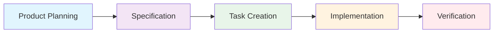

## Your system for spec-driven agentic development.

[Agent OS](https://buildermethods.com/agent-os) transforms AI coding agents from confused interns into productive developers. With structured workflows that capture your standards, your stack, and the unique details of your codebase, Agent OS gives your agents the specs they need to ship quality code on the first try—not the fifth.

Use it with:

✅ Claude Code, Cursor, or any other AI coding tool.

✅ New products or established codebases.

✅ Big features, small fixes, or anything in between.

✅ Any language or framework.

---

## 🚀 Quick Start

Get Agent OS running in your project in under 5 minutes:

### 1. Choose Your Preset

```bash
# For Claude Code users (recommended)
./scripts/project-install.sh --preset claude-code-full

# For Cursor/Windsurf users
./scripts/project-install.sh --preset cursor

# For beginners or simple projects
./scripts/project-install.sh --preset claude-code-basic
```

[📖 Need help choosing? See all presets →](docs/PRESETS.md)

### 2. Create Your First Feature

```bash
# Plan a new feature
/plan-product

# Write specifications
/shape-spec

# Build the feature
/implement-tasks
```

That's it! Agent OS is now configured and ready to help you build better code, faster.

**Performance boost:** Reinstallations are now 30× faster with caching (15s → 0.5s)

## How It Works

Agent OS provides structured workflows that guide AI agents through the development process:



1. **Plan** → Define mission, roadmap, and tech stack
2. **Specify** → Create detailed requirements and technical specs
3. **Task** → Break specs into actionable development tasks
4. **Implement** → Build features following the specifications
5. **Verify** → Test and validate the implementation

---

### Documentation & Installation

Comprehensive docs, guides, & best practices 👉 [buildermethods.com/agent-os](https://buildermethods.com/agent-os)

**Quick links:**
- [📚 All Presets Explained](docs/PRESETS.md)
- [⚡ 5-Minute Tutorial](docs/QUICK_START.md)
- [❓ FAQ & Troubleshooting](docs/FAQ.md)
- [📖 Glossary of Terms](docs/GLOSSARY.md)

---

### Follow updates & releases

Read the [changelog](CHANGELOG.md)

[Subscribe to be notified of major new releases of Agent OS](https://buildermethods.com/agent-os)

---

### Created by Brian Casel @ Builder Methods

Created by Brian Casel, the creator of [Builder Methods](https://buildermethods.com), where Brian helps professional software developers and teams build with AI.

Get Brian's free resources on building with AI:
- [Builder Briefing newsletter](https://buildermethods.com)
- [YouTube](https://youtube.com/@briancasel)

Join [Builder Methods Pro](https://buildermethods.com/pro) for official support and connect with our community of AI-first builders:
