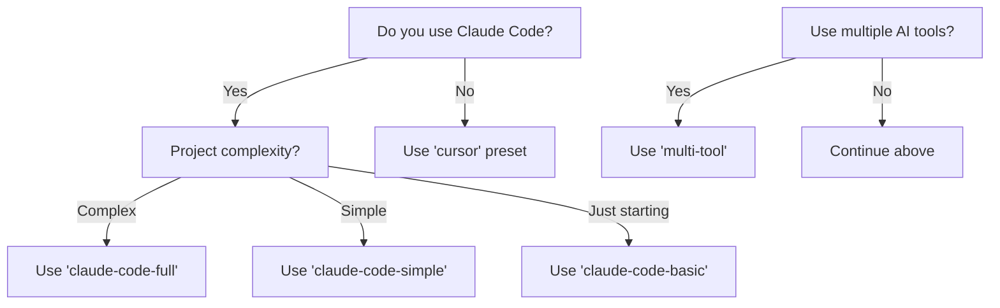

# Agent OS Presets

Agent OS presets are pre-configured setups that optimize the framework for different workflows and tools. Instead of configuring multiple settings manually, you can choose a preset that matches your needs.

## Quick Comparison

| Preset | Best For | Claude Code Commands | Subagents | Skills | Agent OS Commands | Speed |
|--------|----------|----------------------|-----------|---------|-------------------|-------|
| **claude-code-full** | Complex projects, maximum context efficiency | ✅ | ✅ | ✅ | ❌ | Standard |
| **claude-code-simple** | Simpler projects, faster execution | ✅ | ❌ | ✅ | ❌ | Fast |
| **claude-code-basic** | Getting started, learning Agent OS | ✅ | ❌ | ❌ | ❌ | Fastest |
| **cursor** | Non-Claude AI tools (Cursor, Windsurf, etc.) | ❌ | ❌ | ❌ | ✅ | Fast |
| **multi-tool** | Using multiple AI coding tools | ✅ | ✅ | ✅ | ✅ | Standard |

## Preset Details

### 🚀 claude-code-full (Recommended)

The complete Agent OS experience with all Claude Code features enabled.

**Use this if you:**
- Work on complex projects with multiple components
- Want maximum context efficiency for large codebases
- Need specialized agents for different tasks
- Use Claude Code as your primary AI tool

**Features:**
- All commands installed in `.claude/commands/`
- Subagent delegation for complex workflows
- Standards provided as Claude Code Skills
- Full access to Agent OS capabilities

**Example command:**
```bash
./scripts/project-install.sh --preset claude-code-full
```

---

### ⚡ claude-code-simple

A streamlined setup focused on speed and simplicity.

**Use this if you:**
- Work on simpler projects
- Prefer faster execution over advanced features
- Don't need subagent delegation
- Want a balance of features and performance

**Features:**
- Claude Code commands enabled
- No subagents (single-agent workflow)
- Standards provided as Claude Code Skills
- Faster execution without subagent overhead

**Example command:**
```bash
./scripts/project-install.sh --preset claude-code-simple
```

---

### 🎯 claude-code-basic

The simplest way to get started with Agent OS.

**Use this if you:**
- Are new to Agent OS
- Want to learn the system gradually
- Prefer minimal setup
- Have basic project needs

**Features:**
- Claude Code commands enabled
- Standards injected inline (no Skills)
- No subagents
- Fastest setup time

**Example command:**
```bash
./scripts/project-install.sh --preset claude-code-basic
```

---

### 🖥️ cursor

Optimized for non-Claude AI coding tools.

**Use this if you:**
- Use Cursor, Windsurf, or similar AI tools
- Don't use Claude Code
- Want Agent OS workflows in your preferred tool
- Need agent-os compatible commands

**Features:**
- Commands installed in `agent-os/commands/`
- No Claude Code integration
- Inline standards injection
- Compatible with any AI coding tool

**Example command:**
```bash
./scripts/project-install.sh --preset cursor
```

---

### 🛠️ multi-tool

For users who work with multiple AI coding tools.

**Use this if you:**
- Switch between Claude Code and other tools
- Want maximum flexibility
- Need both command formats
- Work in diverse environments

**Features:**
- Both Claude Code and agent-os commands
- Full Claude Code feature set
- Agent OS compatible workflows
- Maximum compatibility

**Example command:**
```bash
./scripts/project-install.sh --preset multi-tool
```

---

## How to Choose Your Preset

### Answer these questions:

1. **Do you use Claude Code?**
   - Yes → Consider claude-code-* presets
   - No → Consider cursor or multi-tool

2. **How complex are your projects?**
   - Complex, multiple components → claude-code-full
   - Simple, straightforward → claude-code-simple or claude-code-basic

3. **Do you use multiple AI tools?**
   - Yes → multi-tool
   - No → Choose the preset for your primary tool

4. **Are you new to Agent OS?**
   - Yes → Start with claude-code-basic
   - No → Choose based on your needs

### Decision Flow



## Using Presets

### Installation with a Preset

When installing Agent OS in your project, specify the preset:

```bash
# Install with claude-code-full preset
./scripts/project-install.sh --preset claude-code-full

# Install with cursor preset
./scripts/project-install.sh --preset cursor

# Install with custom profile
./scripts/project-install.sh --preset claude-code-simple --profile my-profile
```

### Changing Presets

To change presets after installation:

1. Edit your `config.yml` file
2. Change the `preset:` line to your desired preset
3. Run the update script:
   ```bash
   ./scripts/project-update.sh
   ```

### Customizing Presets

You can override any preset setting by uncommenting and modifying the manual configuration in `config.yml`. For example:

```yaml
preset: claude-code-simple

# Override: Enable subagents despite preset
use_claude_code_subagents: true
```

⚠️ **Note:** When using a preset, manual settings override the preset defaults. Most users should keep these commented out unless they have specific needs.

## Performance Comparison

Based on typical usage patterns:

| Preset | Initial Setup | Reinstallation with Cache | Memory Usage |
|--------|---------------|---------------------------|--------------|
| claude-code-full | ~15s | ~0.5s | Higher |
| claude-code-simple | ~10s | ~0.3s | Medium |
| claude-code-basic | ~8s | ~0.2s | Lower |
| cursor | ~8s | ~0.2s | Lower |
| multi-tool | ~20s | ~0.6s | Highest |

*Times are approximate and depend on your system and project size.*

## Need Help?

- Check the [Quick Start Guide](QUICK_START.md) for hands-on tutorials
- See [Custom Profiles](CUSTOM_PROFILES.md) for advanced configuration
- Visit the [FAQ](FAQ.md) for common questions
- Open an issue on GitHub for specific problems